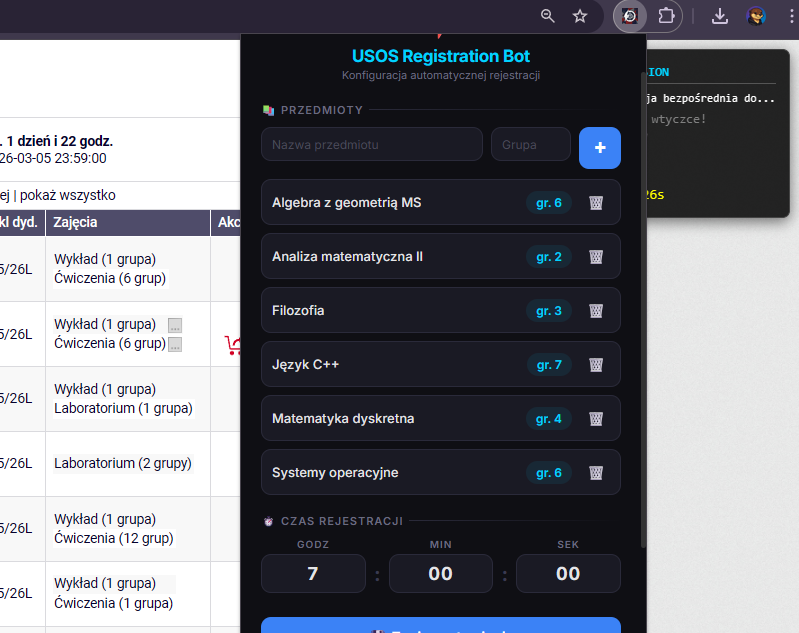

<div align="center">

<<<<<<< HEAD
# ⚡ USOS Registration Bot
=======
# ⚡ USOS Registration
>>>>>>> 9ac49cc157ab0ca7096672cc9b68a3d5fdb4710e

### Secure your preferred course groups — automatically.

A custom browser extension that **automatically registers you for university courses** the exact moment enrollment opens — built specifically for the [USOS](https://www.usos.edu.pl/) system used by **over 50 Polish universities**.

[](#-installation)
[](#-installation)
[](#-installation)
[](#)

</div>

<br>

<div align="center">
  
</div>

---

## 🎯 The Core Problem

Every semester, thousands of university students face the same frustrating reality: **course group registration opens at a fixed time**, and the most desirable groups fill up in a matter of seconds.

Students looking to build a schedule that accommodates their life — whether securing a lab group that doesn't conflict with a lecture or getting a tutorial slot on a preferred day — are forced to compete with hundreds of others furiously clicking "Register" at the exact same moment. Even a one-second delay can leave you stuck with the worst available slots.

**This extension solves that problem.** You simply pre-configure which group number you want for each course and set the registration time. The bot handles the rest, executing the registration click with sub-second precision so you don't have to rely on manual speed.

---

## 🚀 How It Works

Once configured via the extension popup, it runs silently on any USOSweb registration page:

```
  📡 DETECT    →    Identifies the course name directly from the page
  🎯 TARGET    →    Finds and selects your preferred group number
  ⏱️  WAIT      →    Counts down to the exact scheduled registration time
  ⚡ FIRE      →    Executes a precision click at T+500ms
  🔄 RECOVER   →    Auto-refreshes at T+25s if the university server lags
```

Open the registration tabs beforehand, walk away, and return to a successfully confirmed schedule.

---

## ✨ Key Features

### Precision & Automation
- **Millisecond-Precision Timing** — Calculates the optimal offset from the registration opening to counteract server response times.
- **Dynamic Course Detection** — Reads the course name dynamically from the page and matches it to your saved configuration.
- **Smart Group Selection** — Automatically locates and pre-selects the correct checkbox or radio button for your chosen group number.

### Reliability
- **Multi-Tab Staggering** — Open multiple registration pages simultaneously. Each tab generates a random `0–400ms` delay offset to prevent simultaneous requests from colliding.
- **Pre-fire Activation** — The bot arms all timers 3 seconds before the target time, ensuring perfectly scheduled execution.
- **Auto-Refresh Fallback** — If the USOS servers hang and nothing happens after 25 seconds, the bot automatically hits refresh to retry.

### User Experience
- **Live Status HUD** — A real-time overlay appears on every USOS page displaying the detected course, your target group, and a live countdown timer.
- **Modern Settings Popup** — A clean, dynamic interface to add, remove, and manage your courses and registration times on the fly.
- **Visual Feedback** — Target buttons and group rows are highlighted on the page so you can easily verify what the bot is targeting.

---

## 📦 Installation (Chrome Extension)

This is the recommended way to use the bot.

1. Download or clone this repository to your computer.
2. Open your browser and navigate to `chrome://extensions`.
3. Toggle **Developer mode** on (usually in the top-right corner).
4. Click **Load unpacked**.
5. Select the `extension/` folder from the downloaded repository.
6. The extension icon will appear in your toolbar, ready to use!

> Fully compatible with **Google Chrome**, **Microsoft Edge**, **Opera**, **Brave**, and any modern Chromium-based browser.

---

## ⚙️ Usage & Configuration

Click the extension icon in your browser to open the settings panel:

1. **Add Courses**: Type the exact name of your course and your desired group number, then click `+`. You can add as many as you need.
2. **Set Registration Time**: Input the exact time (HH:MM:SS) that the enrollment period opens.
3. **Save**: Click "Zapisz ustawienia". This saves the configuration to your browser and syncs it immediately with any open USOS tabs.

> **Pro Tip:** Set the time to `05:59:59` if registration opens at 6:00. The bot incorporates a slight offset and fires at `06:00:00.500` to account for server delays.

---

## ⚠️ Disclaimer

This tool is created for **educational and personal-use purposes only**, demonstrating concepts like DOM manipulation, browser extensions, and precision timing. Use responsibly and strictly in accordance with your university's guidelines and regulations.

<div align="center">

_Built to level the playing field for student course registrations._  
**If this saved your semester, consider leaving a ⭐ on the repo!**

</div>
